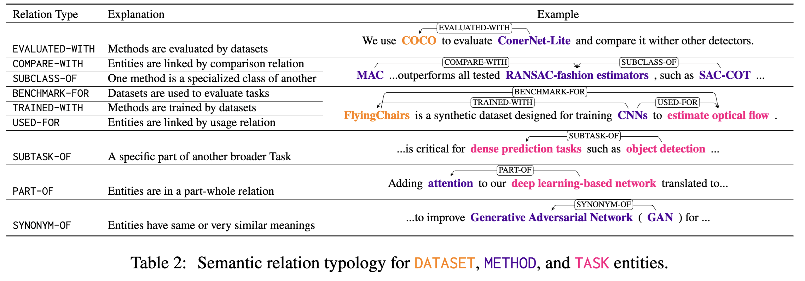

## SciER

The SciER dataset contains both entity annotation and relation annotation for scientific documents.

It covers three kinds of entity types:
- **Dataset**
- **Method**
- **Task**

and 9 relation types:


In the './SciER/LLM' folder, each set/file has already been transfered to LLM friendly format.
Each row is a sentence and has following structure:

```
"doc_id": // The document id of this sentence
"sentence": // The sentence text string
"ner": // A list of ner labels, each element contains the entity string and its entity type. E.g., ["Entity String", "Entity Type"] such as ['feature extraction mechanisms', 'Method']
"rel": // A list of relation labels, used for Relation Extraction. Each element is a triplet, e.g., [Subject Entity, Relation Type, Object Entity], such as ['attention', 'Part-Of', 'recurrent neural networks']
"rel_plus": // A list of strict relation labels, used for end-to-end Relation Extraction. Each element is a triplet, e.g., [Subject Entity:Entity Type, Relation Type, Object Entity:Entity Type], such as ['attention:Method', 'Part-Of', 'recurrent neural networks:Method']
```


In the './SciER/PLM' folder, each set/file is in the format to train supervised models. They are in the this format:

```
{
  # document ID (please make sure doc_key can be used to identify a certain document)
  "doc_key": "CNN_ENG_20030306_083604.6",

  # sentences in the document, each sentence is a list of tokens
  "sentences": [
    [...],
    [...],
    ["tens", "of", "thousands", "of", "college", ...],
    ...
  ],

  # entities (boundaries and entity type) in each sentence
  "ner": [
    [...],
    [...],
    [[26, 26, "LOC"], [14, 14, "PER"], ...], #the boundary positions are indexed in the document level
    ...,
  ],

  # relations (two spans and relation type) in each sentence
  "relations": [
    [...],
    [...],
    [[14, 14, 10, 10, "ORG-AFF"], [14, 14, 12, 13, "ORG-AFF"], ...],
    ...
  ]
}

```

Our used supervised methods include:
- [PURE](https://github.com/princeton-nlp/PURE)
- [PL-Marker](https://github.com/thunlp/PL-Marker)
- [HGERE](https://github.com/yanzhh/HGERE)

For the LLMs evaluation, please find the used prompt for in-context learning in our paper.


## Citation
If you use our dataset in your research, please cite our work:

```
@inproceedings{zhang-etal-2024-scier,
    title = "{S}ci{ER}: An Entity and Relation Extraction Dataset for Datasets, Methods, and Tasks in Scientific Documents",
    author = "Zhang, Qi  and
      Chen, Zhijia  and
      Pan, Huitong  and
      Caragea, Cornelia  and
      Latecki, Longin Jan  and
      Dragut, Eduard",
    editor = "Al-Onaizan, Yaser  and
      Bansal, Mohit  and
      Chen, Yun-Nung",
    booktitle = "Proceedings of the 2024 Conference on Empirical Methods in Natural Language Processing",
    month = nov,
    year = "2024",
    address = "Miami, Florida, USA",
    publisher = "Association for Computational Linguistics",
    url = "https://aclanthology.org/2024.emnlp-main.726",
    doi = "10.18653/v1/2024.emnlp-main.726",
    pages = "13083--13100",
    abstract = "Scientific information extraction (SciIE) is critical for converting unstructured knowledge from scholarly articles into structured data (entities and relations). Several datasets have been proposed for training and validating SciIE models. However, due to the high complexity and cost of annotating scientific texts, those datasets restrict their annotations to specific parts of paper, such as abstracts, resulting in the loss of diverse entity mentions and relations in context. In this paper, we release a new entity and relation extraction dataset for entities related to datasets, methods, and tasks in scientific articles. Our dataset contains 106 manually annotated full-text scientific publications with over 24k entities and 12k relations. To capture the intricate use and interactions among entities in full texts, our dataset contains a fine-grained tag set for relations. Additionally, we provide an out-of-distribution test set to offer a more realistic evaluation. We conduct comprehensive experiments, including state-of-the-art supervised models and our proposed LLM-based baselines, and highlight the challenges presented by our dataset, encouraging the development of innovative models to further the field of SciIE.",
}
```